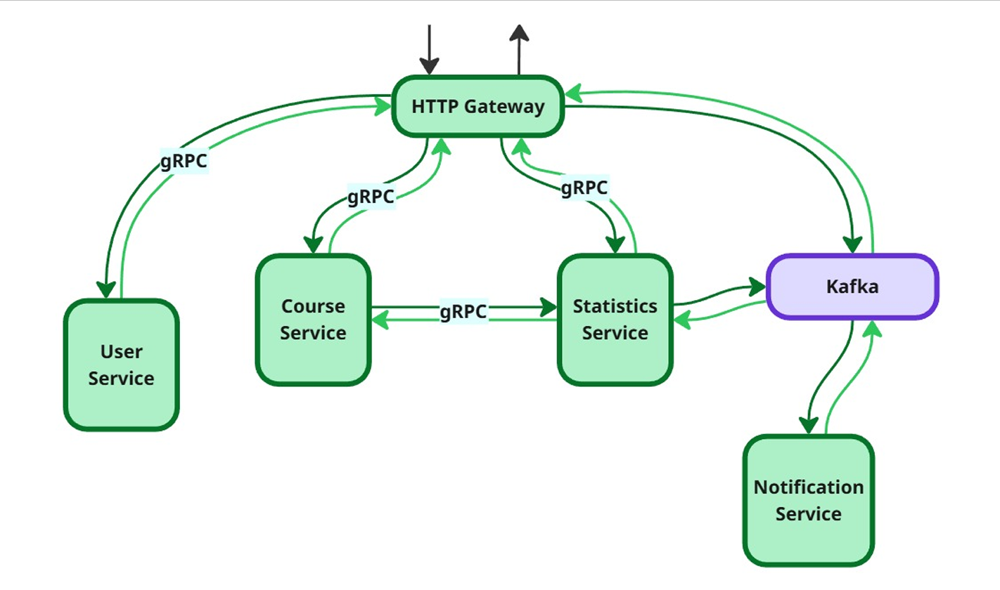

# Monolingo

## Краткое описание проекта

**Monolingo** – платформа для изучения языков (иностранных или программирования – мы пока не решили).

Планируется следующий функционал:

- Регистрация пользователей (для роли student – обычный учащийся)

- Создание/редактирование курсов (creator)

- Запись на курс (student)

- Выполнение модулей, состоящих из уроков (student)

- Получение очков опыта за выполненные уроки (student)

- Создание leaderboard’ов пользователей по набранным очкам опыта

- Возможность подписываться на других пользователей (student)

- Отслеживание прогресса (еженедельный отчёт по успеваемости для пользователя)

- Наличие ударного режима (количество дней подряд, которые пользователь занимался на платформе)

- Наличие доски объявлений (новые подписки, новости друзей, информация по курсам)

## Функциональные требования

### Профили пользователей

- Система должна обеспечивать регистрацию пользователей по нику (отображаемому имени пользователя), электронной почте (уникальной среди пользователей) и паролю.

- Система должна поддерживать вход по почте и паролю.

- Система должна позволять пользователю редактировать свои данные: ник, почта, пароль.

- Система должна предоставлять публичную страницу профиля пользователя (с отображением статистики, ударного режима, списка курсов и лидербордов).

- Система должна рассчитывать и отображать ударный режим – количество дней подряд с хотя бы одним выполненным уроком.

- Система должна сбрасывать ударный режим, если пользователь пропустил весь календарный день.

### Социальные взаимодействия

- Система должна предоставлять возможность подписываться на других пользователей.

- Система должна предоставлять возможность отписываться от других пользователей.

- Система должна уведомлять пользователя о новостях тех пользователей, чьим подписчиком он является (например, о еженедельных успехах в виде места в турнирной таблице - лидерборде, прохождении определённого количества уроков в день).

### Роли и права доступа

- Система должна поддерживать три роли: Student (ученик), Creator (создатель курсов), Admin.

- Только пользователи с ролью Student имеют право записываться на курсы, проходить на них уроки, подписываться на других пользователей. Creator и Admin специфичны для создания курсов и осуществления иных действий, недоступных Student роли.

- Только пользователи с ролью Creator или Admin должны иметь возможность создавать, редактировать и удалять курсы (в случае Creator редактировать можно только свои курсы).

- Только пользователь с ролью Admin может просматривать список учащихся курса.

- Система должна предоставлять администраторам возможность просмотра любых профилей пользователей, любых курсов и статистики.

- Система должна позволять администратору снимать курсы с публикации.
### Курсы

- Система должна позволять создавать курсы (название, описание, язык обучения, список модулей/уроков).

- Система должна позволять создателям добавлять, редактировать, удалять и менять порядок модулей и уроков внутри курса.

- Система должна позволять публиковать курс (переводить из состояния черновика в общий доступ).

- Система должна предоставлять каталог курсов всем пользователям.

- Система должна предоставлять базовую информацию о курсе пользователям (название, язык обучения, описание, список модулей).

- Система должна позволять пользователю записаться на курс и отписаться от него.

- Система должна предоставлять пользователю возможность получать доступ к материалам изучаемого им урока.

- Прогресс пользователей внутри курса должен сохраняться (пройденные уроки отмечаться пройденными, отображаться процент пройденного материала).

- Система должна блокировать доступ к следующему уроку до успешного завершения предыдущего.

- Система должна начислять очки опыта (XP) за каждое выполненное задание и урок (количество XP настраивается создателем).

- Система должна предоставлять пользователю список курсов, на которые он записан.

### Лидерборды

- Система должна предоставлять возможность составлять еженедельную статистику пользователей по набранному опыту (за неделю).

- При получении пользователем призового места, должно быть отправлено уведомление об этом событии его подписчикам.

### Уведомления

- Система должна предоставлять возможность просмотра всех уведомлений пользователя за определённый промежуток времени.

- Еженедельно пользователь должен получать отчёт об успеваемости (полученные очки опыта, количество пройденных уроков).

## Сервисы

1. HTTP Gateway
   
3. User Service

4. Course Service

5. Statistics Service

6. Notification Service

### HTTP Gateway
- Идентификация и аутентификация пользователя.

- Выступает единой точкой входа для всех запросов к системе.

- Осуществляет маршрутизацию запросов.

- Осуществляет агрегацию данных.

### User Service
- Ответственен за данные пользователей (ник, почта, пароль, …).

- Реализует логику создания и редактирования аккаунтов, подписки на других пользователей.

- Обладает информацией о роли admin.

- Реализует авторизацию пользователей на основе известных ему ролей.

### Course Service

- Обладает информацией о ролях student/creator.

- Реализует авторизацию пользователей на основе известных ему ролей.

- Ответственен за данные по курсам, состоящим из модулей и уроков (название, язык обучения, список модулей, состояние Draft/Published, …).

- Реализует логику создания/получения/редактирования/удаления курсов/модулей/уроков.

- Реализует логику записи пользователей на курсы и удаления пользователей с курсов.

- Владеет информацией об отношениях пользователей и курсов (на какие курсы записаны пользователи; какую роль на курсе имеет пользователь, если имеет; какие уроки/модули/курсы открыты студентам; кто является создателями курсов).

### Statistics Service
- Отслеживает статистику пользователя (опыт, количество пройденных уроков, ударный режим).

- Создаёт еженедельные лидерборды на основе собранной статистики.

- Создаёт еженедельные отчёты пользователей на основе собранной статистики.

- Реализует логику начисления опыта и обновления/обнуления ударного режима при прохождении студентом урока или отсутствия выполненных уроков в течение дня.

### Notification Service
- Хранит историю событий пользователей.

- Умеет собирать доску новостей для пользователя в зависимости от его подписок.

- Отправляет уведомление пользователю при появлении нового события у его подписки.

## Взаимодействие сервисов
Все микросервисы общаются при помощи gRPC, кроме Notification – он полностью реактивный.

### Диаграма

