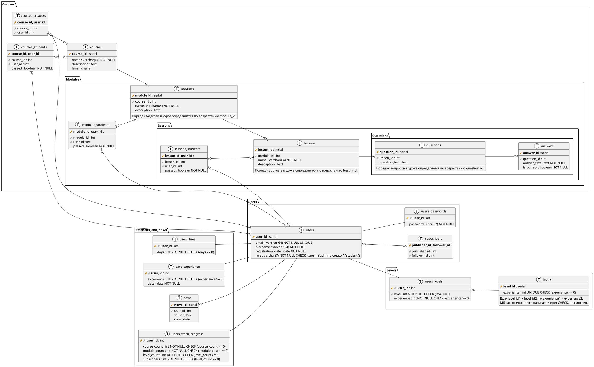

## ERD

```plantuml
@startuml
!define primary_key(x) <b><color:#b8861b><&key></color> x</b>
!define foreign_key(x) <color:#aaaaaa><&key></color> x
!define column(x) <color:#efefef><&media-record></color> x
!define table(x) entity x << (T, white) >>

left to right direction

package Users {
    table(users) {
        primary_key(user_id) : serial 
        --
        column(email) : varchar(64) NOT NULL UNIQUE
        column(nickname) : varchar(64) NOT NULL
        column(registration_date) : date NOT NULL
        column(role) : varchar(7) NOT NULL CHECK (type in ('admin', 'creator', 'student'))
    }

    table(subscribers) {
        primary_key("publisher_id, follower_id") : 
        --
        foreign_key(publisher_id) : int 
        foreign_key(follower_id) : int 
    }

    table(users_passwords) {
        primary_key(foreign_key(user_id)) : int  
        --
        column(password) : char(32) NOT NULL
    }
}


package Levels {
    table(levels) {
        primary_key(level_id) : serial 
        --
        column(experience) : int UNIQUE CHECK (experience >= 0)
        --
        Если level_id1 > level_id2, то experience1 > experience2.
        Мб как-то можно это написать через CHECK, не смотрел.
    }

    table(users_levels) {
        primary_key(foreign_key(user_id)) : int  
        --
        foreign_key(level) : int NOT NULL CHECK (level >= 0) 
        column(experience) : int NOT NULL CHECK (experience >= 0)
    }
}


package Courses {
    together {
        table(сourses) {
            primary_key(course_id) : serial 
            --
            column(name) : varchar(64) NOT NULL
            column(description) : text
            column(level) : char(2)
        }

        table(courses_creators) {
            primary_key("course_id, user_id") : 
            --
            foreign_key(course_id) : int 
            foreign_key(user_id) : int 
        }

        table(courses_students) {
            primary_key("course_id, user_id") : 
            --
            foreign_key(course_id) : int 
            foreign_key(user_id) : int 
            column(passed) : boolean NOT NULL
        }
    }


    package Modules {
        table(modules) {
            primary_key(module_id) : serial 
            --
            foreign_key(course_id) : int 
            column(name) : varchar(64) NOT NULL
            column(description) : text
            --
            Порядок модулей в курсе определяется по возрастанию module_id.
        }

        table(modules_students) {
            primary_key("module_id, user_id") : 
            --
            foreign_key(module_id) : int 
            foreign_key(user_id) : int 
            column(passed) : boolean NOT NULL
        }


        package Lessons {
            table(lessons) {
                primary_key(lesson_id) : serial 
                --
                foreign_key(module_id) : int 
                column(name) : varchar(64) NOT NULL
                column(description) : text
                --
                Порядок уроков в модуле определяется по возрастанию lesson_id.
            }

            table(lessons_students) {
                primary_key("lesson_id, user_id") : 
                --
                foreign_key(lesson_id) : int 
                foreign_key(user_id) : int 
                column(passed) : boolean NOT NULL
            }

            package Questions {
                table(questions) {
                    primary_key(question_id) : serial 
                    --
                    foreign_key(lesson_id) : int 
                    column(question_text) : text
                    --
                    Порядок вопросов в уроке определяется по возрастанию question_id.
                }

                table(answers) {
                    primary_key(answer_id) : serial 
                    --
                    foreign_key(question_id) : int 
                    column(answer_text) : text NOT NULL
                    column(is_correct) : boolean NOT NULL
                }
            }
        }
    }
}

package Statistics_and_news {
    table(news) {
        primary_key(news_id) : serial 
        --
        foreign_key(user_id) : int 
        column(value) : json
        column(date) : date
    }

    table(users_week_progress) {
        primary_key(foreign_key(user_id)) : int
        --
        column(course_count) : int NOT NULL CHECK (course_count >= 0)
        column(module_count) : int NOT NULL CHECK (module_count >= 0)
        column(level_count) : int NOT NULL CHECK (level_count >= 0)
        column(sunscribers) : int NOT NULL CHECK (level_count >= 0)
    }

    table(users_fires) {
        primary_key(foreign_key(user_id)) : int
        --
        column(days) : int NOT NULL CHECK (days >= 0)
    }

    table(date_experience) {
        primary_key(foreign_key(user_id)) : int  
        --
        column(experience) : int NOT NULL CHECK (experience >= 0)
        column(date) : date NOT NULL
    }
}


"users" -- "users_passwords"

"users" }o--o{ "subscribers"

"users_levels" -up- "users"
"users_levels" }o-- "levels"

"сourses" --o{ "modules"

"modules" --o{ "lessons"

"lessons" --o{ "questions"

"questions" --o{ "answers"

"courses_students" }o--o{ "users"
"courses_students" }o--o{ "сourses"

"courses_creators" }o--o{ "users"
"courses_creators" }o--o{ "сourses"

"modules_students" }o--o{ "users"
"modules_students" }o--o{ "modules"

"lessons_students" }o--o{ "users"
"lessons_students" }o--o{ "lessons"

"news" }o-- "users"

"users_week_progress" -- "users"

"users_fires" -- "users"

"date_experience" -- "users"

@enduml
```
