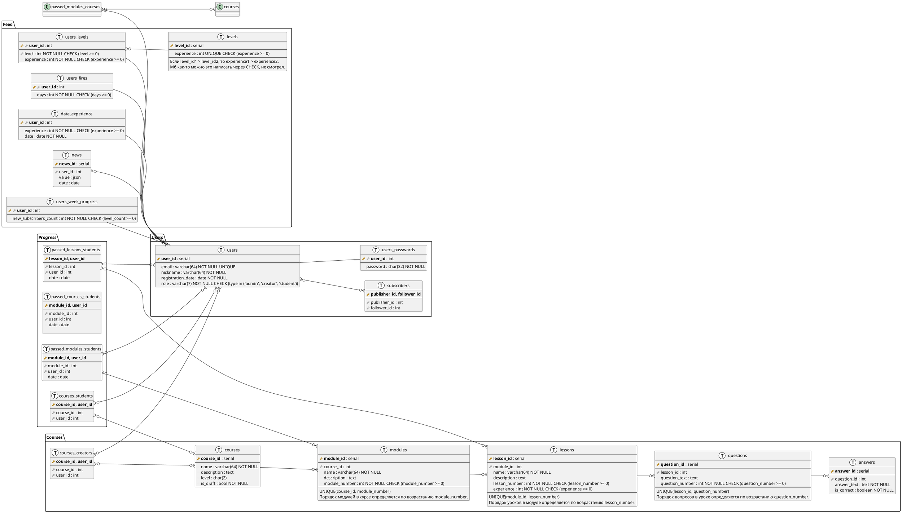

## ERD

```plantuml
@startuml
!define primary_key(x) <b><color:#b8861b><&key></color> x</b>
!define foreign_key(x) <color:#aaaaaa><&key></color> x
!define column(x) <color:#efefef><&media-record></color> x
!define table(x) entity x << (T, white) >>

left to right direction

package Users {
    table(users) {
        primary_key(user_id) : serial 
        --
        column(email) : varchar(64) NOT NULL UNIQUE
        column(nickname) : varchar(64) NOT NULL
        column(registration_date) : date NOT NULL
        column(role) : varchar(7) NOT NULL CHECK (type in ('admin', 'creator', 'student'))
    }

    table(subscribers) {
        primary_key("publisher_id, follower_id")
        --
        foreign_key(publisher_id) : int 
        foreign_key(follower_id) : int 
    }

    table(users_passwords) {
        primary_key(foreign_key(user_id)) : int  
        --
        column(password) : char(32) NOT NULL
    }
}


package Courses {
    table(сourses) {
        primary_key(course_id) : serial 
        --
        column(name) : varchar(64) NOT NULL
        column(description) : text
        column(level) : char(2)
        column(is_draft) : bool NOT NULL
    }

    table(courses_creators) {
        primary_key("course_id, user_id")
        --
        foreign_key(course_id) : int 
        foreign_key(user_id) : int 
    }

    table(modules) {
        primary_key(module_id) : serial 
        --
        foreign_key(course_id) : int 
        column(name) : varchar(64) NOT NULL
        column(description) : text
        column(module_number) : int NOT NULL CHECK (module_number >= 0)
        --
        UNIQUE(course_id, module_number)
        Порядок модулей в курсе определяется по возрастанию module_number.
    }

    table(lessons) {
        primary_key(lesson_id) : serial 
        --
        foreign_key(module_id) : int 
        column(name) : varchar(64) NOT NULL
        column(description) : text
        column(lesson_number) : int NOT NULL CHECK (lesson_number >= 0)
        column(experience) : int NOT NULL CHECK (experience >= 0)
        --
        UNIQUE(module_id, lesson_number)
        Порядок уроков в модуле определяется по возрастанию lesson_number.
    }

    table(questions) {
        primary_key(question_id) : serial 
        --
        foreign_key(lesson_id) : int 
        column(question_text) : text
        column(question_number) : int NOT NULL CHECK (question_number >= 0)
        --
        UNIQUE(lesson_id, question_number)
        Порядок вопросов в уроке определяется по возрастанию question_number.
    }

    table(answers) {
        primary_key(answer_id) : serial 
        --
        foreign_key(question_id) : int 
        column(answer_text) : text NOT NULL
        column(is_correct) : boolean NOT NULL
    }
}


package Progress {
    table(courses_students) {
        primary_key("course_id, user_id")
        --
        foreign_key(course_id) : int
        foreign_key(user_id) : int
    }

    table(passed_courses_students) {
        primary_key("module_id, user_id")
        --
        foreign_key(module_id) : int
        foreign_key(user_id) : int
        column(date) : date

    }

    table(passed_modules_students) {
        primary_key("module_id, user_id")
        --
        foreign_key(module_id) : int
        foreign_key(user_id) : int
        column(date) : date
    }

    table(passed_lessons_students) {
        primary_key("lesson_id, user_id")
        --
        foreign_key(lesson_id) : int
        foreign_key(user_id) : int
        column(date) : date
    }
}


package Feed {
    table(news) {
        primary_key(news_id) : serial 
        --
        foreign_key(user_id) : int 
        column(value) : json
        column(date) : date
    }

    table(users_week_progress) {
        primary_key(foreign_key(user_id)) : int
        --
        column(new_subscribers_count) : int NOT NULL CHECK (level_count >= 0)
    }

    table(users_fires) {
        primary_key(foreign_key(user_id)) : int
        --
        column(days) : int NOT NULL CHECK (days >= 0)
    }

    table(date_experience) {
        primary_key(foreign_key(user_id)) : int  
        --
        column(experience) : int NOT NULL CHECK (experience >= 0)
        column(date) : date NOT NULL
    }

    table(levels) {
        primary_key(level_id) : serial 
        --
        column(experience) : int UNIQUE CHECK (experience >= 0)
        --
        Если level_id1 > level_id2, то experience1 > experience2.
        Мб как-то можно это написать через CHECK, не смотрел.
    }

    table(users_levels) {
        primary_key(foreign_key(user_id)) : int  
        --
        foreign_key(level) : int NOT NULL CHECK (level >= 0) 
        column(experience) : int NOT NULL CHECK (experience >= 0)
    }
}


"users" -- "users_passwords"

"users" }o--o{ "subscribers"

"users_levels" -up- "users"
"users_levels" }o-- "levels"

"сourses" --o{ "modules"

"modules" --o{ "lessons"

"lessons" --o{ "questions"

"questions" --o{ "answers"

"courses_students" }o--o{ "users"
"courses_students" }o--o{ "сourses"

"courses_creators" }o--o{ "users"
"courses_creators" }o--o{ "сourses"

"passed_modules_courses" }o--o{ "users"
"passed_modules_courses" }o--o{ "courses"

"passed_modules_students" }o--o{ "users"
"passed_modules_students" }o--o{ "modules"

"passed_lessons_students" }o--o{ "users"
"passed_lessons_students" }o--o{ "lessons"

"news" }o-- "users"

"users_week_progress" -- "users"

"users_fires" -- "users"

"date_experience" -- "users"

@enduml
```
