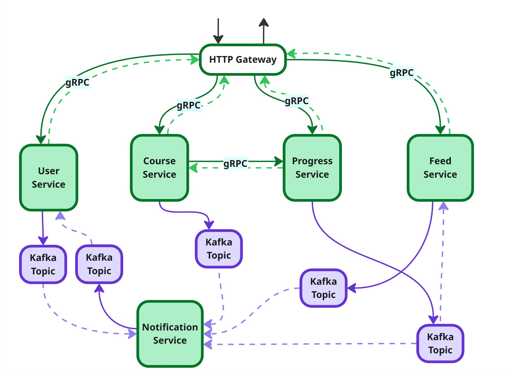

# Monolingo

## Краткое описание проекта

**Monolingo** – платформа для изучения иностранных языков.

Функционал:

- Регистрация пользователей (для роли student – обычный учащийся)

- Создание/редактирование/удаление курсов/учебного контента (creator)

- Запись на курс (student)

- Выполнение модулей, состоящих из уроков (student)

- Получение очков опыта за выполненные уроки (student)

- Создание еженедельных leaderboard’ов пользователей по набранным очкам опыта

- Возможность подписываться на других пользователей (student)

- Отслеживание прогресса (еженедельный отчёт по успеваемости для пользователя)

- Наличие ударного режима (количество дней подряд, которые пользователь занимался на платформе)

- Наличие доски объявлений (новые подписки, новости друзей, информация по курсам)

## Функциональные требования

### Профили пользователей

- Система должна обеспечивать регистрацию пользователей по нику (отображаемому имени пользователя), электронной почте (уникальной среди пользователей) и паролю.

- Система должна поддерживать вход по почте и паролю.

- Система должна позволять пользователю редактировать свои данные: ник, почта, пароль, фото профиля.

- Система должна предоставлять публичную страницу профиля пользователя (с отображением статистики, ударного режима, списка курсов).

- Система должна рассчитывать и отображать ударный режим – количество дней подряд с хотя бы одним выполненным уроком.

- Система должна сбрасывать ударный режим, если пользователь пропустил весь календарный день.

### Социальные взаимодействия

- Система должна предоставлять возможность подписываться на других пользователей.

- Система должна предоставлять возможность отписываться от других пользователей.

- Система должна уведомлять пользователя о новостях тех пользователей, чьим подписчиком он является (например, о еженедельных успехах в виде места в турнирной таблице – лидерборде, прохождении определённого количества уроков в день).

### Роли и права доступа

- Система должна поддерживать три роли: Student (ученик), Creator (создатель курсов), Admin.

- Только пользователи с ролью Student имеют право записываться на курсы, проходить на них уроки, подписываться на других пользователей. Creator и Admin специфичны для создания курсов и осуществления административного и модерационного управления системой.

- Только пользователи с ролью Creator должны иметь возможность создавать, редактировать и удалять учебный контент, причём только для _своих_ курсов.

- Пользователи с ролью Admin имеют право назначать роль Creator.

- Только пользователь с ролью Admin может просматривать список учащихся курса.

- Система должна предоставлять администраторам возможность просмотра любых профилей пользователей, любых курсов и статистики.

- Система должна позволять администратору снимать курсы с публикации.

### Курсы

- Система должна позволять создавать курсы (название, описание, язык обучения, список модулей/уроков).

- Система должна позволять создателям добавлять, редактировать, удалять и менять порядок модулей и уроков внутри курса.

- Система должна позволять публиковать курс (переводить из состояния черновика в общий доступ).

- Система должна предоставлять каталог опубликованных курсов всем пользователям.

- Система должна предоставлять базовую информацию об опубликованном курсе пользователям (название, язык обучения, описание, список модулей).

- Система должна позволять пользователю записаться на опубликованный курс и отписаться от него.

- Система должна предоставлять пользователю возможность получать доступ к материалам изучаемого им урока.

- Прогресс пользователей внутри курса должен сохраняться (пройденные уроки отмечаться пройденными, отображаться процент пройденного материала).

- Система должна блокировать доступ к следующему уроку до успешного завершения предыдущего.

- Система должна начислять очки опыта (XP) за каждое выполненное задание и урок (количество XP настраивается создателем).

- Система должна предоставлять пользователю список курсов, на которые он записан.

- Система должна предоставлять возможность оповещения всех пользователей при публикации новых курсов.

- Система должна предоставлять возможность оповещать пользователей об изменениях в курсах, на которые они записаны, при утверждении факта оповещения создателем и только в том случае, если изменения касаются модулей/уроков, уже пройденных пользователем.

- Система должна предоставлять возможность создателям курса указать уровень курса согласно CEFR.

- Система должна повысить уровень пользователю при получении им определённого количества опыта (при повышении уровня количество опыта, требуемое для достижения следующего уровня не уменьшается).

- Система должна предоставлять возможность просмотра материалов курса его создателям и пользователю с ролью admin.

### Лидерборды

- Система должна предоставлять возможность составлять еженедельную статистику пользователей по набранному за неделю опыту по следующему алгоритму: каждую неделю пользователи распределяются по “корзинам” (группам по 20-25 пользователей), внутри которых сортируются по невозрастанию согласно набранным ими в течение недели очкам опыта.

- Система должна предоставлять возможность просмотра лидерборда конкретного пользователя самому пользователю и пользователю с ролью “администратор”.

- При получении пользователем призового места, должно быть отправлено уведомление об этом событии ему и его подписчикам.

### Уведомления

- Система должна предоставлять возможность просмотра всех уведомлений пользователя за определённый промежуток времени.

- Еженедельно пользователь должен получать отчёт об успеваемости (полученные очки опыта, количество пройденных уроков).

## Сервисы

1. HTTP Gateway

2. User Service

3. Course Service

4. Progress Service

5. Feed Service

6. Notification Service

### HTTP Gateway

- Идентификация и аутентификация пользователя.

- Выступает единой точкой входа для всех запросов к системе.

- Осуществляет маршрутизацию запросов.

- Осуществляет агрегацию данных.

### User Service

- Ответственен за данные пользователей (фото профиля, ник, почта, пароль, …).

- Обладает информацией о ролях student/creator/admin.

- Реализует логику создания и редактирования аккаунтов, подписки на других пользователей.

- Реализует авторизацию пользователей на основе известных ему ролей.

### Course Service

- Ответственен за данные по курсам, состоящим из модулей и уроков (название, язык обучения, список модулей, состояние Draft/Published, …).

- Реализует логику создания/получения/редактирования/удаления курсов/модулей/уроков.

- Посылает уведомление о создании/изменении курса всем причастным на основе определённых правил.

### Progress Service

- Реализует авторизацию пользователей на основе ролей.

- Отслеживает статистику пользователя по урокам (какие уроки по каким модулям и курсам пройдены, пройден ли курс до конца).

- Посылает сообщения о прохождении пользователем урока в Kafka.

- Владеет информацией об отношениях пользователей и курсов (на какие курсы записаны пользователи; какую роль на курсе имеет пользователь, если имеет; какие уроки/модули/курсы открыты студентам; кто является создателями курсов).

- Реализует логику записи пользователей на курсы и удаления пользователей с курсов.

### Feed Service

- Реализует логику начисления опыта, повышения уровня и обновления ударного режима при прохождении студентом урока или отсутствия выполненных уроков в течение дня.

- Хранит историю событий пользователей.

- Умеет собирать доску новостей для пользователя в зависимости от его подписок.

- Создаёт еженедельные отчёты пользователей на основе собранной статистики.

- Создаёт еженедельные лидерборды на основе собранной статистики.

- В случае появления особых событий, связанных с ударным режимом (например, достижения 100 дней ударного режима) или занятием призового места в лидерборде, отправляет сообщение об этом в Notification Service.

### Notification Service

- Отправляет уведомление пользователю при появлении нового события у его подписки.

- Отправляет уведомление пользователю при появлении нового события, связанного с курсами (добавление курса, изменения в курсах, на которые записан пользователь).

## Взаимодействие сервисов

Все микросервисы общаются при помощи gRPC, кроме Notification – он полностью реактивный, и Feed Service, который получает уведомления при помощи Kafka.

### Kafka

Поддерживаются следующие топики:

- *Отправитель*: Progress Service.\
*Слушатели*: Feed Service и Notification Service.\
*Назначение*: топик для отправки уведомлений о том, что пользователь завершил урок.

- *Отправитель*: Course Service\
*Слушатель*: Notification Service.\
*Назначение*: топик для уведомлений о публикации или редактировании курса.

- *Отправитель*: Feed Service\
*Слушатель*: Notification Service\
*Назначение*: топик для отправки уведомлений о достижениях пользователя (долгий огненный режим, призовое место на лидерборде и т. п.).

- *Отправитель*: Notification Service\
*Слушатель*: User Service\
*Назначение*: топик запросов на получение почтовых адресов пользователей.

- *Отправитель*: User Service\
*Слушатель*: Notification Service\
*Назначение*: топик ответов на запрос о получении почтовых адресов пользователей.

### Диаграмма

## Пояснения
### Роли и права доступа
***Admin*** – роль, предоставляющая право запрашивать и получать любую информацию как о пользователях, так и о курсах (в любом состоянии публикации), но не предоставляющая прав на изменение существующих сущностей (курсы, профили пользователей), кроме управления жизненным циклом учебного контента (снятие с публикации, назначение роли Creator). Кроме того, администратор не участвует в учебном процессе и не выступает в роли студента или создателя учебного контента.

***Creator*** – роль, отвечающая за создание/редактирование конкретных курсов, но не предоставляющая прав доступа к какой-либо пользовательской (User) информации.

>[!IMPORTANT]
>Подразумеваются, что _Creator_ – это внутренняя роль сотрудника платформы, а не пользовательский статус.

***Student*** – роль, выдаваемая конечным пользователям платформы, предоставляющая права на редактирование и получение определённой информации, касающейся данного пользователя и других пользователей, а также предоставляющая право на получение определённой информации по определённым курсам.
